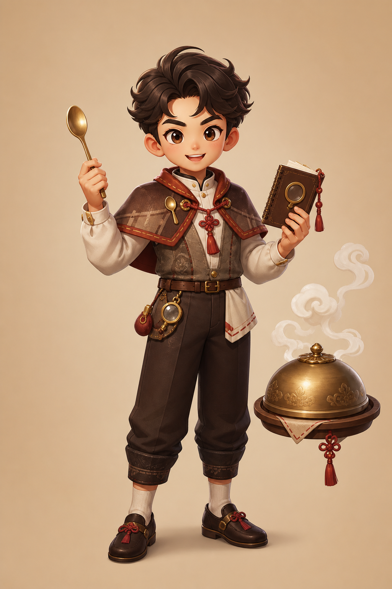
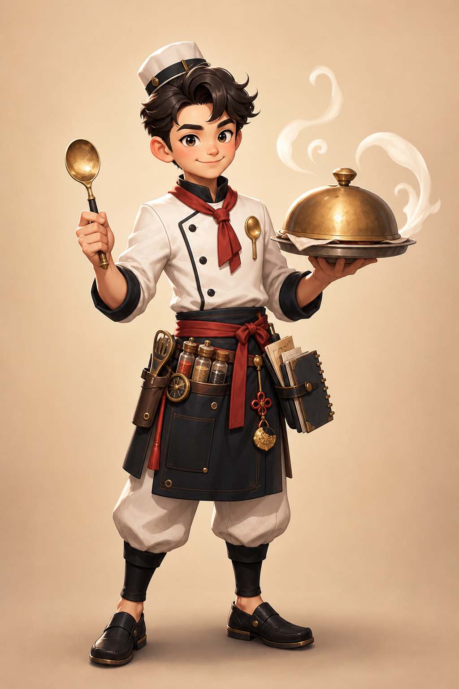
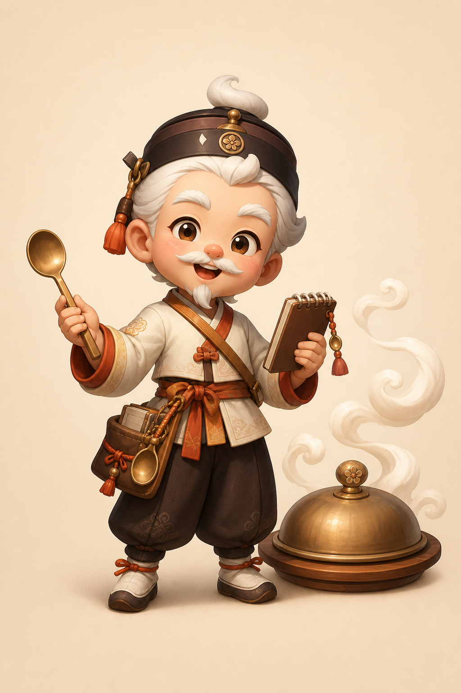

# Bogle Canonical Source Art Board

Updated: 2026-05-31

## Verdict

🔶추천: **Concept A를 canonical source-art direction으로 채택**하고, Concept B의 chef-tool density를 일부 흡수한다. Concept C는 참고만 한다.

이번 산출물은 최종 Rive/Lottie 파일이 아니라, 다음 리깅 작업의 **approved source-art direction**이다. CSS fallback character는 계속 fallback이며, 이 보드를 기준으로 실제 layered art/Rive rig를 제작한다.

## Generated assets

| ID | Image | Role | Score | Use |
|---|---|---|---:|---|
| A | `docs/current/character-art/bogle-concept-a.png` | detective-oracle | 8.6/10 | **Canonical direction** |
| B | `docs/current/character-art/bogle-concept-b.png` | chef-investigator | 8.1/10 | Costume/prop density reference |
| C | `docs/current/character-art/bogle-concept-c.png` | table-spirit scholar | 7.4/10 | Warmth/folk texture reference only |

Integrity:

```txt
3ca540c6bf7fd31f37edce2f789dde3f38109c46e2d577744fe8ccbdac92c912  docs/current/character-art/bogle-concept-a.png
26c67d3b860f422f8b2ed66646f32f215518f59c0c23eece6cb3d61e5393bc43  docs/current/character-art/bogle-concept-b.png
cb1e373fb872f0d6b5f9499f2a68855c78306694c3be8587d78dc775a9fc5d00  docs/current/character-art/bogle-concept-c.png
```

## Concept evaluation

### Concept A — selected



Strengths:

- Best balance of **detective + oracle + Korean table** without Akinator-like genie/lamp cues.
- Clear riggable separation: head, brows, eyes, mouth, spoon arm, notebook arm, torso, belt, plate/lid, steam.
- Face has enough brow/eye/mouth detail for subtle answer reactions.
- Plate is separate from body, making reveal staging easier than if the plate is held.
- Silhouette is more distinctive than the current CSS toy and less generic than a pure chef.

Risks:

- Still slightly “anime boy hero”; needs stronger unique Bogle identity in final art.
- Hair is dense; Rive implementation should simplify into 5–7 hair/steam masses.
- Notebook has small decorative details that should become clean vector shapes.

Adopt:

- Youthful clever host, detective cape/scarf, spoon pointer, notebook, separate covered plate, steam curls.

### Concept B — secondary reference



Strengths:

- Strong food/chef readability and high prop density.
- Plate/lid and spoon are prominent and premium.
- Costume reads cleanly on mobile.

Risks:

- Too chef-forward; “detective inference engine” is weaker than A.
- Plate is held, which makes reveal/lid-lift rigging harder.
- Less distinct from ordinary cooking mascot.

Borrow:

- Apron utility belt, spice/tool mini-details, confident serving posture, clean chef whites contrast.

### Concept C — not selected



Strengths:

- Warm and memorable table-spirit/scholar tone.
- Most distinct from current toy mascot.
- Steam/folk details could support a premium Korean-table mood.

Risks:

- Elderly sage/mustache direction may narrow appeal and reduce playful Akinator-like host energy.
- Big head/short body could drift back toward toy mascot.
- Face acting is charming but less flexible for skeptical/confident/prune reactions.

Borrow only:

- Warm folk trim, compact clue notebook, steam swirl language.

## Canonical art direction

Name: **입맛 탐정 보글**

One-line design:

> A clever Korean dining-table detective-oracle: youthful, expressive, warm, holding a brass spoon pointer and clue notebook while a separate covered plate becomes the reveal stage.

Must keep:

- Original IP; no genie, lamp, blue wizard, turban, Akinator poses, or Akinator copy.
- Warm ivory/brown/brass/gochugaru red palette.
- A clearly readable silhouette at 320px mobile width.
- Face acting: independent brows, pupils/gaze, eyelids, mouth shapes, cheek accents.
- Props as inference tools, not decoration:
  - spoon = ask/point/prune
  - notebook = answer capture/thinking
  - covered plate = confidence/reveal
  - steam = thought/aura/transition

Must avoid:

- Chibi toy proportions that feel like a low-cost puppet.
- Generic chef-only identity.
- Excessive small ornamental detail that cannot rig cleanly.
- Separate generated raster pose swaps that break identity.

## Rive/Lottie layer breakdown v1

### Core body

- `body_torso`
- `cape_left`, `cape_right`
- `jacket_front`
- `scarf_knot`, `scarf_tail_left`, `scarf_tail_right`
- `belt`, `pouch`, `medallion`
- `leg_left`, `leg_right`, `shoe_left`, `shoe_right`

### Head/face

- `head_base`
- `ear_left`, `ear_right`
- `hair_back_mass`
- `hair_front_1`, `hair_front_2`, `hair_front_3`
- `steam_hair_curl`
- `brow_left`, `brow_right`
- `eye_left_white`, `eye_right_white`
- `pupil_left`, `pupil_right`
- `eyelid_left`, `eyelid_right`
- `cheek_left`, `cheek_right`
- `mouth_neutral`, `mouth_smile`, `mouth_oops`, `mouth_thinking`, `mouth_reveal`

### Spoon arm

- `arm_spoon_upper`
- `arm_spoon_lower`
- `hand_spoon`
- `spoon_bowl`
- `spoon_handle`
- joints: `shoulder_right`, `elbow_right`, `wrist_right`

### Notebook arm

- `arm_note_upper`
- `arm_note_lower`
- `hand_note`
- `note_cover`
- `note_pages`
- `note_ink_check`
- joints: `shoulder_left`, `elbow_left`, `wrist_left`

### Reveal stage

- `plate_base`
- `plate_lid`
- `lid_knob`
- `dish_glow`
- `dish_shadow`
- `table_shadow`

### Atmosphere

- `steam_1`, `steam_2`, `steam_3`
- `spark_1`, `spark_2`, `spark_3`
- `rim_light`
- `ground_shadow`

## Motion mapping

| App cue | Body | Face | Props | Notes |
|---|---|---|---|---|
| `idle` | soft breath, tiny float | blink/gaze wander | steam loop | no attention-grabbing loop |
| `ask` | lean forward | curious brows | spoon point | one clear question pose |
| `answerAccepted` | small nod | focused smile | notebook ink check | 700ms minimum visible reaction |
| `thinking` | huddle inward | narrowed eyes | steam spiral, note scan | suspense before next question |
| `confident` | chest up | spark eyes/smile | plate forward | pre-reveal buildup |
| `surprised` | recoil | open mouth/high brows | spoon drop | wrong guess reaction |
| `recover` | reset posture | calm detective | note reopen | remove rejected candidate |
| `reveal` | celebratory lift | bright payoff | lid lift + dish glow | result as staged declaration |

## Next implementation target

1. Convert Concept A into a simplified vector/Rive-ready turnaround, borrowing B’s utility-belt/chef detail.
2. Produce separate transparent layer exports for the above layer list.
3. Build a Rive state machine with the existing DOM contract.
4. Replace `CHARACTER_RUNTIME = 'css-fallback'` with `rive` only after live browser QA confirms entry → answer → thinking → guess → wrong recovery → reveal.
